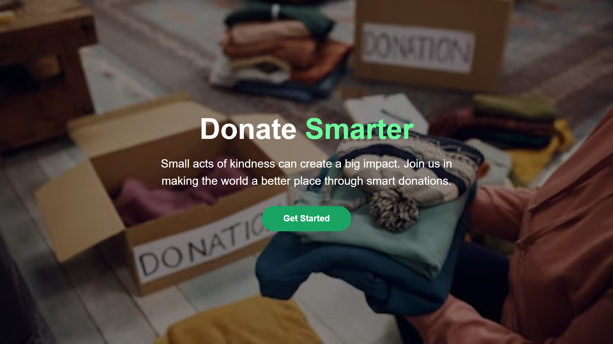
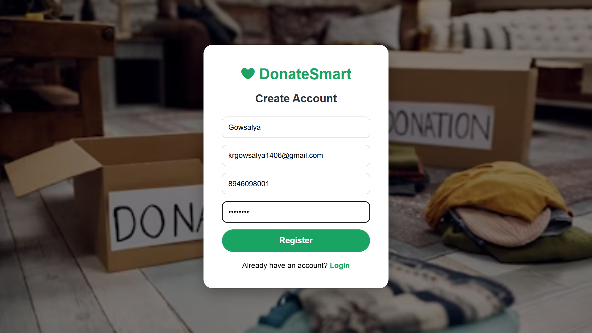
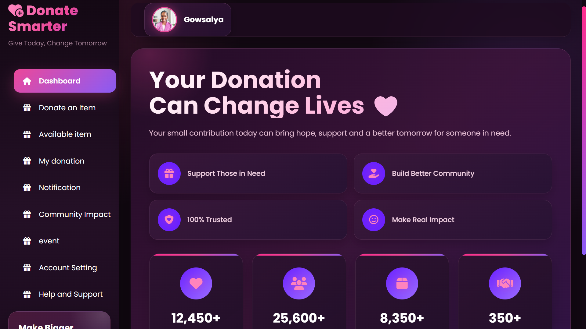
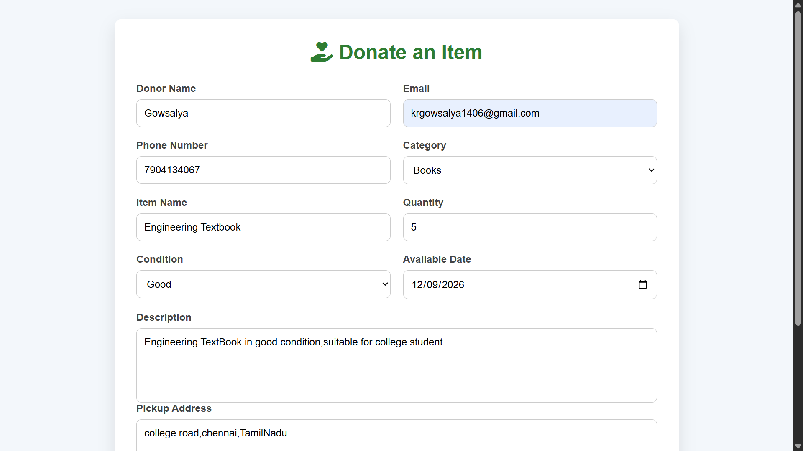
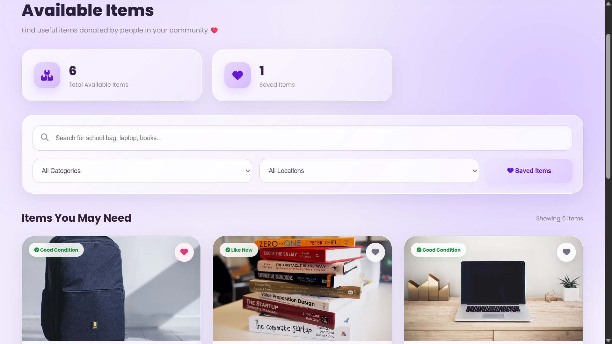
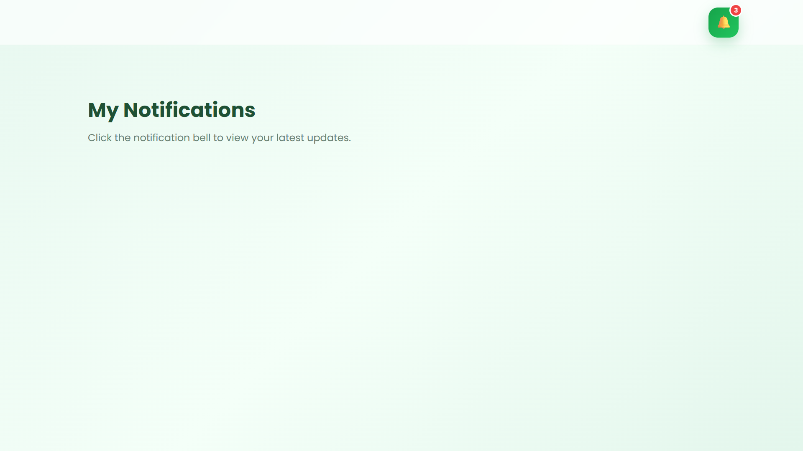
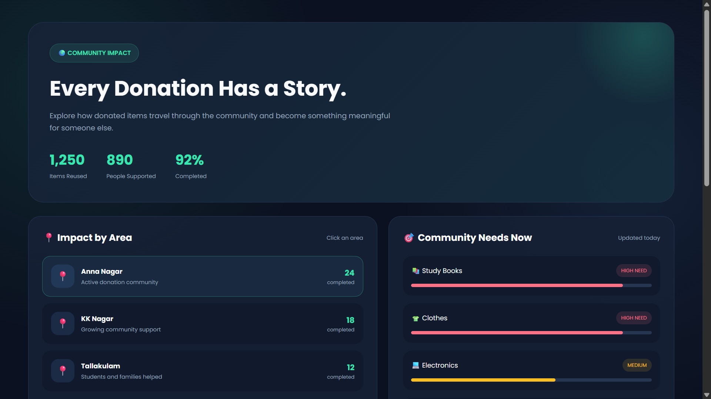
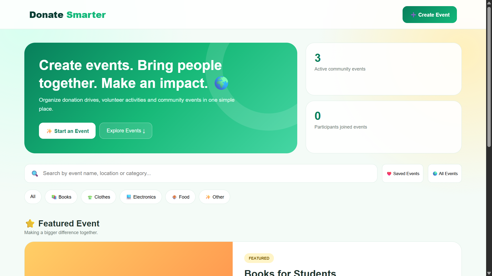
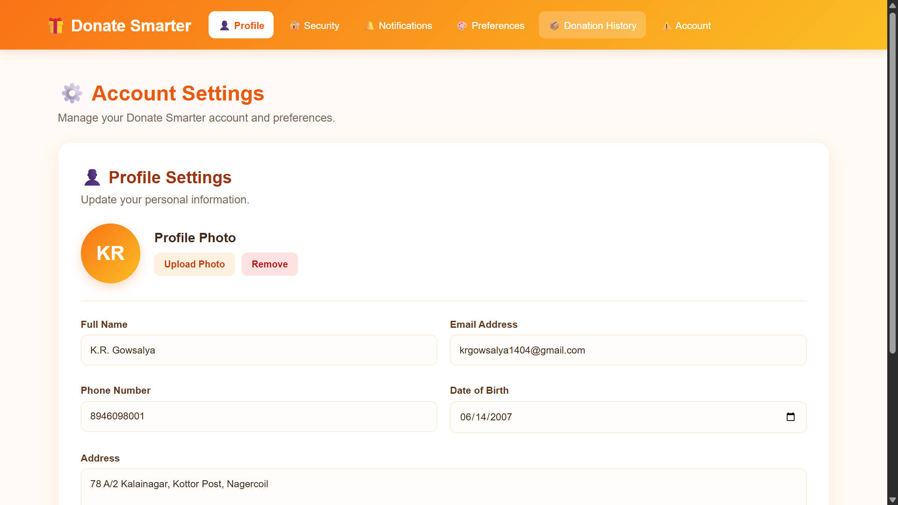
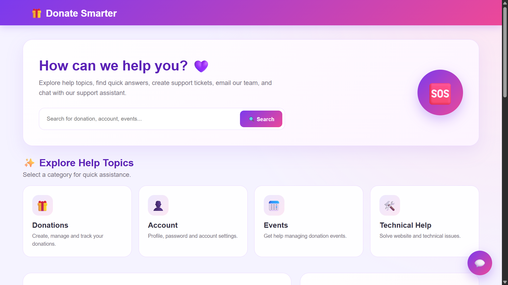

# 💝 DonateSmart

A modern and user-friendly Donation Management Platform developed using HTML, CSS, JavaScript, and PHP. DonateSmart is designed to make the process of donating useful items simple, organized, and accessible.

The platform allows users to provide their personal details, enter donation information, upload item images, and submit donation requests through an easy-to-use interface.

DonateSmart aims to encourage people to donate unused or useful items to those who need them while reducing unnecessary waste and promoting social responsibility.

# 🎯 Project Objective

The main objective of DonateSmart is to create a simple digital platform that makes item donation easier and more organized.

Instead of allowing useful items to go unused or become waste, the platform provides a convenient way for donors to submit their items and share essential information about their donations.

The project focuses on:

Making the donation process simple

Collecting organized donor information

Providing item details and images

Validating donation form information

Giving users immediate donation confirmation

Creating a clean and responsive user experience

# 💡 Why DonateSmart?

Many useful items are thrown away simply because people do not have an easy way to donate them.

DonateSmart provides a simple digital approach to this problem by allowing users to submit donation information through an organized platform.

The project demonstrates how web technologies can be used to support social responsibility while providing a practical and user-friendly digital experience.

# ✨ Feature

👤 Donor Registration

🔐 User Login

📝 Donation Form

🎁 Donate Items

🏷️ Donation Categories

📦 Item Details

🖼️ Item Image Upload

📍 Location Details

📞 Donor Contact Details

📧 Email Validation

📱 Phone Number Validation

✅ Required Field Validation

⚠️ Error Messages

🔔 Success Notifications

🎉 Donation Success Page

🔄 Form Reset

📋 Donation Summary

🕒 Donation Submission Tracking

📊 Donation History

🔎 Search Donations

🎯 Filter Donations by Category

📍 Location-Based Donations

🤝 Donor–Receiver Matching

🏢 NGO Support

❤️ Favorite/Save Donations

📱 Mobile Responsive Design

🌙 Dark/Light Mode

🎨 Modern User Interface

⚡ Interactive JavaScript Components

🐘 PHP Form Processing

🗄️ Database Integration

🔒 Secure Data Handling

📊 Donation Dashboard

📈 Donation Statistics

🔔 Donation Status Updates

📩 Email Confirmation

🗺️ Nearby Donation Centers

🌱 Waste Reduction & Reuse Support

🤝 Community Donation Support

🏆 Donor Recognition

📜 Digital Donation Records

☁️ Cloud Deployment Support

## 🎥 project Demo


[Project Demo]()

## 🚀 project Demo
[Live Demo]()


## 📸 Screenshots

### 🔐 Donate Smarter
DonateSmarter is a user-friendly donation platform that helps people donate unused items to those in need. It promotes reuse, reduces waste, and makes the donation process simple and meaningful.



### 🔐 Create account
Create your DonateSmarter account to easily manage your donations and make a positive impact by giving unused items a second life.



### 🔐 Dashboard
View and manage your donations, track donation status, and quickly access all DonateSmarter features from one place.



### 🔐 Donate an item
List your unused items and give them a second life by donating them to people in need.



### 🔐 Available item

Explore useful donated items available for those who need them.


### 🔐 Notification
The Notification System provides real-time updates on donations, requests, pickups, deliveries, achievements, and urgent needs, keeping users informed and engaged.




### 🔐 Comunity Impact
The Community Impact feature shows how donations support people in need, highlighting lives helped, resources shared, and positive changes created in the community.




### 🔐 Event
The Events feature displays upcoming donation drives, community activities, and volunteering events, helping users participate and contribute to social causes.




### 🔐 Account Setting
The Account Settings feature allows users to manage their profile, password, notifications, privacy, and account preferences.



### 🔐 Help and support
Get quick help with donations, resource requests, account issues, and other support needs.



## 📁 Project Structure

```text
📁 Donate-Smarter
│
├── 📄 index.html
├── 📄 login.html
├── 📄 register.html
├── 📄 dashboard.html
├── 📄 donate.html
├── 📄 available.html
├── 📄 mydonation.html
├── 📄 notification.html
├── 📄 accountsetting.html
├── 📄 event.html
├── 📄 helpandsupport.html
├── 📄 communityimpact.html
├── 📄 scan.html
├── 📄 success.html
├── 📄 upgrade.html
│
├── 🎨 dashboard.css
├── 🎨 donate.css
├── 🎨 available.css
│
├── ⚙️ dashboard.js
├── ⚙️ donate.js
├── ⚙️ available.js
│
└── 📁 image
    │
    ├── 🖼️ availableItem.png
    ├── 🖼️ createaccount.png
    ├── 🖼️ dashboard.png
    ├── 🖼️ donateitem.png
    ├── 🖼️ donatesmarter.png
    ├── 🖼️ event.png
    ├── 🖼️ help.png
    ├── 🖼️ impact.png
    ├── 🖼️ login.png
    ├── 🖼️ mydonation.png
    ├── 🖼️ notification.png
    └── 🖼️ upgrade.png

```
## 🔮 Future Enhancements

AI-Based Donation Matching

Location-Based Donations

Real-Time Notifications

Donation Tracking

NGO Integratio

User Verification

Donation Analytics

Impact Calculator

In-App Communication

Online Monetary Donations

Rewards and Badges

Mobile Application

Volunteer Management

Pickup and Delivery Management

Smart Donation Recommendations

Multi-Language Support

Emergency Donation Requests

Donor and Receiver Profiles

Donation History.
Fraud Detection and Prevention
QR-Based Donation Tracking
Automated Email/SMS Alerts
Community Donation Campaigns
Environmental Impact Tracking
Cloud-Based Data Management
